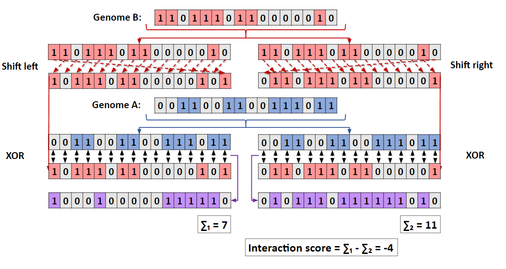
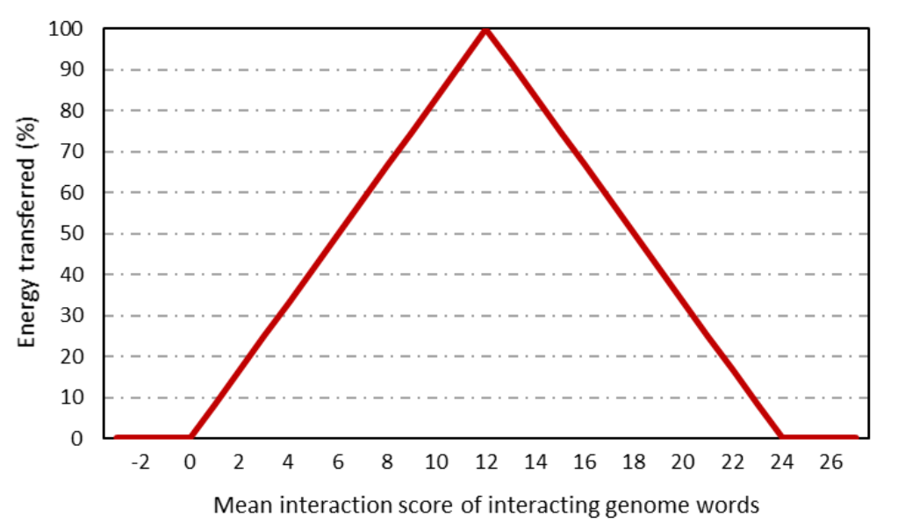

# Summary

Simulations are an important tool for understanding ecology and evolution because they allow greater precision and customisation than traditional experiments or observation [@zurrell:2010; @cabral:2017; @barido-sottani:2020]. Additionally, they can model phenomena that occur over timescales too long to be easily empirically observed, but too short to be studied using the fossil record [@garwood:2019]. REvoSim v3.0.0 is a flexible, spatially explicit, individual-based eco-evolutionary simulation tool written in C++. It is an update of REvoSim v2 [@garwood:2019] that increases the flexibility of genetic architecture within the simulation while also incorporating ecological processes such as inter-organism interactions.

# Background

REvoSim v2 [@garwood:2019] simulates the ecology of hundreds of thousands of sessile organisms on a spatially explicit environment grid. Each organism is a 64-bit binary genome. The first 32 genome bits determine the organism’s ability to collect energy from the environment by interacting with three independent environmental variables, each represented by one colour channel of an RGB image of the same size as the environment grid. The simulation proceeds in timesteps during which organisms collect energy from their environment, breed, if they have sufficient energy and, after a fixed number of timesteps, die. Mutations may arise during breeding, and organisms are grouped into species based on a strict biological species concept [@mayr:1942], with breeding compatibility based on genetic similarity.

# New Features

## Genome architecture
REvoSim v3 replaces the 64-bit genome architecture of REvoSim v2 with a configurable system of 32-bit genome “words”- organisms can comprise any number of these words, and different word combinations can be utilised by REvoSim’s different systems. 

## Systems
All REvoSim processes (e.g. fitness, mutation, breeding, species ID) are now designated systems, and can be applied to specified genome words as required. Newly added systems include interactions and pathogens, introduced below. Further additions allow genome words to be assigned to modify mutation rate and/or reproductive mode (sexual or asexual).

## Pathogen dynamics
REvoSim v3 incorporates an optional “pathogen layer” — a grid with identical dimensions to the environment. Pathogen genomes’ architecture is defined by the system’s options and, at a configurable rate, pathogen genome words are compared with those of organisms in the same position on the grid. These comparisons have a 50% chance of killing an organism if it has an identical genome string to the pathogen, and a 0% chance if every bit is different, with linear interpolation between these extremes.

Pathogens evolve over time, and may do so through drift or selection for virulence. When pathogens evolve through drift, each position on the grid contains a single pathogen which changes through mutation at a configurable rate. When pathogens evolve through selection, each position on the grid contains five pathogen genomes. In each timestep, the most virulent pathogen in each position in the pathogen grid, or positions adjacent to it, is applied, duplicated, and then returned, overwriting an existing pathogen.

## Variable masks
REvoSim v3 adds mechanism that allows for the productivity and/or mutation rates of organisms to vary spatially and temporally within the simulation. This is achieved via variable masks - image files with the same dimensions as the simulated environment, where the magnitude of a masked variable at any given position in the environment is equal to that variable’s global value, multiplied by the brightness (0-255) of the red channel of the pixel in the mask image at that position.

## Interactions
Inter-organism interactions can be simulated in REvoSim v3 using one of two approaches, referred to as the ‘genome blocks’ and ‘XOR’ mechanisms. Both interaction mechanisms are designed such that small genome changes result in small changes to interaction scores. In both cases, the number of attempted interactions per-timestep per-individual is configurable. Individuals attempt to interact by searching for another individual at the same position as them in the environment. The probability of success of this search increases as organism-count in the cell increases. If another individual is found, an interaction occurs. Under ‘genome blocks’, an ‘interaction score’ is derived from a configurable table that describes how every possible combination of two-bit organism genome components interact \autoref{fig:figure1}. Under ‘XOR’, one of the genomes is rotationally shifted by one bit both to the left and to the right \autoref{fig:figure2}, and each shifted genome is combined with an exclusive-or function with the unshifted genome. The number of 1s in the right-shifted, XORed binary sequence subtracted from the number of 1s in the left-shifted, XORed binary sequence, creates an interaction score \autoref{fig:figure2}. 

Interactions may alter either organism fitnesses, modifying the rate at which they collect energy from the environment, or allow organisms to transfer energy from one another. Under the former, the interaction score (which may be negative) is added to the fitness of the instigating organism. Under the latter, the interaction score controls the proportion of the sought organism’s current energy that is lost in the interaction \autoref{fig:figure3}. Optionally, energy transfer can be disabled where this proportion would be below some threshold. Of the energy lost by the sought organism, a configurable fraction is transferred to the instigating organism, reflecting loss of energy to metabolic inefficiency [@lindeman:1942; @anderson:2009].

To accompany the interactions system, REvoSim v3 includes the option to seed either three or five (in addition to the previous default of one) different genomes at the start of the simulation. When three or five genomes are seeded, preset genomes are used that are known to form a single, unbranching food-chain under the XOR mechanism [@barbier:2019].

To track the effects of energy-transfer interactions, REvoSim v3 records a ‘trophic level’ for each organism over the course of its lifetime [@anderson:2009]. Trophic level is initially inherited from the parent, but subsequently becomes one greater than an average of the trophic levels of all of the sources from which the organism has gained energy during its life, weighted by the amount gained from each source. This results in calculated trophic levels that mirror those in real world ecosystems (i.e. zero for producers, one for herbivores, two for primary carnivores, etc.).

## Logging
The logging system within the software has been redesigned to improve flexibility. The user can now define a header, a string output for every polling iteration with grid-level statistics, and an output for every species every polling iteration. These allow any combination of outputs required for an experiment. 

## Species identification
The species identification algorithm has been recoded to improve performance. 

# Statement of need

Despite simulations becoming progressively more common in evolutionary ecology [@zurrell:2010; @cabral:2017; @barido-sottani:2020], many function at the level of the population, rather than the individual [@rangel:2018; @hagen:2021; @reddin:2022]. Furthermore, those simulations that do function at the level of the individual often focus on ecology, with no evolutionary component [@smith:2010; @harfoot:2014]. REvoSim is unusual in that it simulates evolutionary processes that occur within populations, rather than just between them [@garwood:2019], and is highly efficient, allowing long time spans and large population sizes on modest hardware.

The new features added in REvoSim v3 allow for the study of ecological processes (predation, symbioses, and pathogens) that have been implicated in the evolution of diversity gradients, such as the latitudinal biodiversity gradient [@johnson:2012; @roslin:2017]. Furthermore, these processes allow REvoSim to be used as a tool for complex ecological simulation in the absence of evolutionary processes, and have also increased the versatility of the tool throughout.

REvoSim v3’s mask tool allows it to simulate geographical areas of varying size, shape, and configuration and, therefore, study the impacts of these properties on evolutionary processes and biodiversity. For example, this allows REvoSim to be used to simulate habitat fragmentation [@matthews:2014] and the island species-area relationship [@matthews:2021], both of which are important topics in conservation science [@hanski:2007].

# Current associated projects

RJG - Pathogens and environmental disturbance as drivers of reproductive mode.

ENF and MDS - Effects of evolutionary processes on trophic level abundance equilibria.

ENF, MDS and RJG - Rates of evolution during speciation.

# Availability

REvoSim v3.0.0 is freely available from Zenodo (https://doi.org/10.5281/zenodo.7699771) and GitHub (https://github.com/palaeoware/revosim/releases/tag/v3.0.0). Newer releases of the REvoSim software will be available on GitHub (https://github.com/palaeoware/revosim).

# Acknowledgements

ENF was supported by funding from the Natural Environment Research Council (NERC award NE/S007415/1). RJG was supported by NERC award NE/T000813/1.

# References